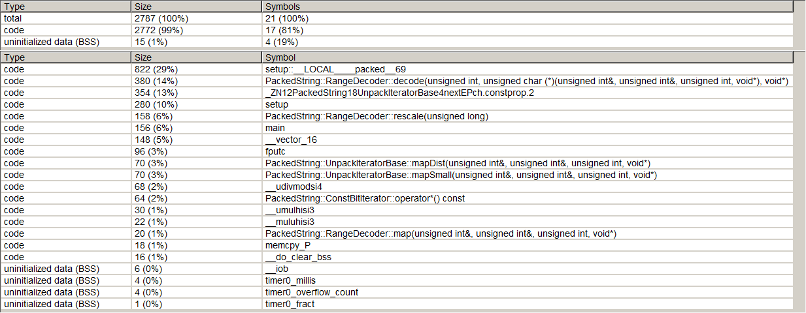

PackedString
============

Library to store strings packed in program space to unpack them at runtime.

Features
========

The library provides functions to pack string literals for maximal usage of the available flash
capacity on micro controllers. It uses an arithmetic coder
(see [range coder](https://web.archive.org/web/20151022055156/http://www.sable.mcgill.ca/publications/techreports/2007-5/bodden-07-arithmetic-TR.pdf))
for probability based coding of the values generated by a variant of [LZSS](https://en.wikipedia.org/wiki/Lempel%E2%80%93Ziv%E2%80%93Storer%E2%80%93Szymanski),
which is used for deduplication. All data is compressed at compile time by the C++ compiler.  
The unpack functions incorporate only a 1490 byte overhead on a ATmega328p despite its good
compression ratio.  

Usage
=====

Include the provided header file (PackedString.hpp) and define your string constant with the
`DEF_PACKED_STR` macro. The data can be unpacked with the `UNPACK_STR_FOR` macro. Both can be done
in one step using the `UNPACK_STR` macro.  The packed data size can be determined with the
`PACKED_STR_SIZE` macro.  
The string is unpacked just before the null-termination character, which is not included.  

Example
=======

Arduino example:  
```c++
#include "PackedString.hpp"

void setup(void) {
	Serial.begin(115200);
	while ( ! Serial ); 
	UNPACK_STR(const char b, 4, "Hello World!") {
		Serial.write(b);
	}
}
```
  
This example only stores the data compressed if the result is smaller than its plain text variant,
using the C++17 `if constexpr` feature:  
```c++
#include <cstdio>
#include "PackedString.hpp"

#define WINDOW_SIZE 4

#define PLAINTEXT_STR \
	"Hello World!"

int main() {
	if constexpr ((PACKED_STR_SIZE(WINDOW_SIZE, PLAINTEXT_STR) + 1490) < sizeof(PLAINTEXT_STR)) {
		UNPACK_STR(const char b, WINDOW_SIZE, PLAINTEXT_STR) {
			fputc(b, stdout);
		}
	} else {
		UNPACK_STR_PLAIN(const char b, PLAINTEXT_STR) {
			fputc(b, stdout);
		}
	}
	
	return 0;
}
```
Note that most compilers will optimize the not matching branch away even without `if constexpr`.  

Here is a comparison of the compiled code targeting an ATmega328p with a 1378 byte string literal.  
Plain text string:  


Packed string:  


Building
========

The following dependencies are given:  
- C++14 (no STL)

The provided functions fall back to uncompressed strings if the compiler does not support C++14 or newer.  
The library is provided header only.  

License
=======

Modified 3-clause BSD license. See [license file](LICENSE).  
